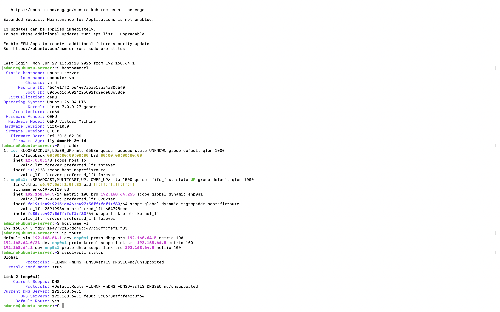
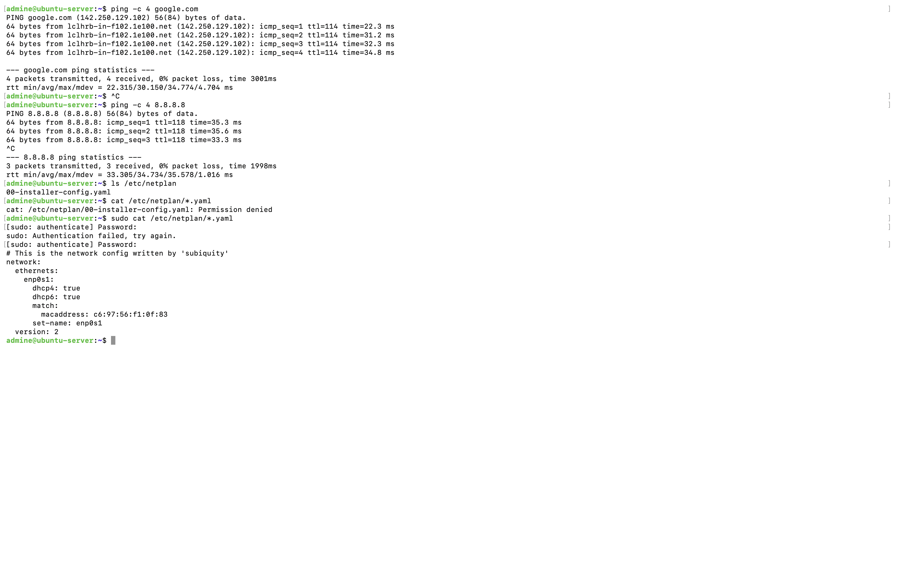

# Chapter 2 :  Server Network Configuration

## Overview

After installing Ubuntu Server the next step is to understand how the server communicates with other systems. A server relies on its network configuration to obtain an IP address, discover the default gateway, communicate with external networks, resolve domain names and provide services. The objective of this chapter is to inspect the current network configuration without modifying it, understanding how Ubuntu configures networking using **Netplan** and verify that the server can successfully communicate with the Internet. Understanding how Linux networking works is a fundamental skill for every system administrator and cybersecurity professional.


## Learning Objectives

By completing this chapter I learned how to:

- Identify the server hostname and system information
- View network interfaces and assigned IP addresses
- Identify the default gateway
- Inspect DNS configuration
- Understand how Ubuntu Server stores network configuration using Netplan
- Verify Internet connectivity using ICMP (ping)
- Understand the difference between DHCP and Static IP addressing

# Current Network Configuration

The following commands were used to inspect the server configuration.

```bash
hostnamectl

ip addr

hostname -I

ip route

resolvectl status
```


## These commands reveal following information:

### Hostname

```text
ubuntu-server
```
The hostname uniquely identifies the server within the network. It is commonly used for administration, SSH connections, monitoring platforms and logging systems.


### Network Interface

```text
enp0s1
```
Ubuntu names network interfaces using predictable naming conventions. This interface represents the server's primary Ethernet adapter.


### IPv4 Address

```text
192.168.64.5
```
This private IPv4 address was automatically assigned by the DHCP server running within the UTM virtual network. The address uniquely identifies the server on the local network.


### Default Gateway

```text
192.168.64.1
```

The default gateway is the router responsible for forwarding packets outside the local network. Whenever the server communicates with external hosts such as Google, traffic is forwarded through this gateway.

### DNS Server

```text
192.168.64.1
```

# Netplan Configuration

Ubuntu Server stores network configuration inside:

```text
/etc/netplan/
```

The current configuration was inspected using:

```bash
sudo cat /etc/netplan/*.yaml
```

Current configuration:

```yaml
network:
  ethernets:
    enp0s1:
      dhcp4: true
      dhcp6: true
      match:
        macaddress: c6:97:56:f1:0f:83
      set-name: enp0s1
  version: 2
```

This configuration shows that both IPv4 and IPv6 addresses are obtained automatically using DHCP. DHCP (Dynamic Host Configuration Protocol) automatically provides IP address, subnet mask, default gateway and DNS server. Without DHCP these settings would need to be configured manually. For this laboratory environment, DHCP provides a simple and reliable configuration while learning Linux server administration.


# Connectivity Testing

Network connectivity was verified using:

```bash
ping -c 4 google.com

ping -c 4 8.8.8.8
```

The successful responses confirmed internet connectivity, correct routing, functional DNS resolution and zero packet loss

# What I Learned

This chapter provided a practical understanding of how Ubuntu Server joins a network.I learned how to identify the server's hostname, inspect network interfaces, view IP addressing, locate the default gateway, inspect DNS configuration and understand how Ubuntu stores network settings using Netplan. Rather than immediately modifying the configuration this chapter focused on understanding how Linux networking works before making administrative changes in later chapters.

