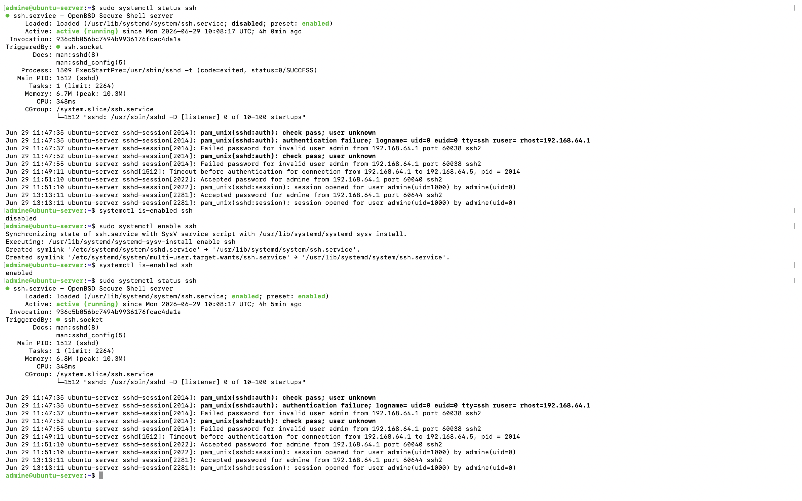
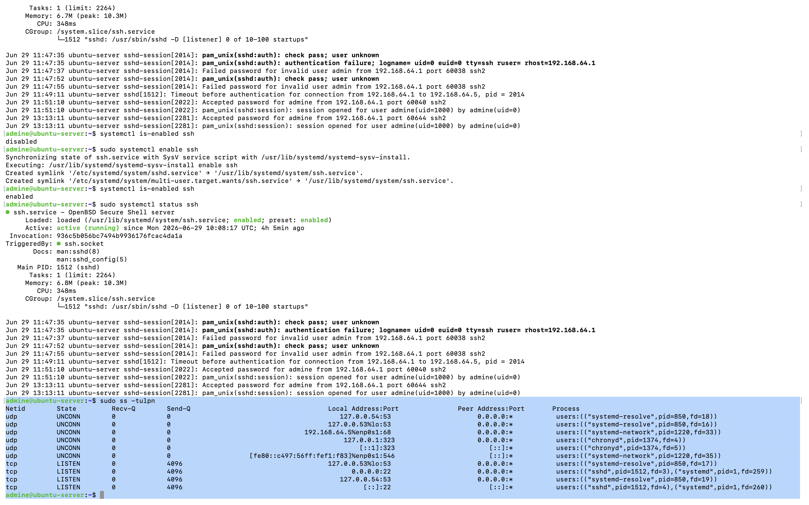

# Chapter 3 : OpenSSH Server Installation and Remote Access

## Objective

The objective of this chapter was to install, verify and configure the OpenSSH server on Ubuntu Server. This allows the server to be administered remotely from another computer using the Secure Shell (SSH) protocol. Remote administration is one of the most common methods used by Linux system administrators, cloud engineers and cybersecurity professionals to securely manage Linux servers without requiring physical access or a graphical desktop environment.

# Verifying the SSH Service

The SSH service was verified using systemd.

```bash
sudo systemctl status ssh
```
The output confirmed that OpenSSH Server installed and loaded and service running successfully. It also listen for incoming connections

# Checking Service Startup Behaviour

The service startup configuration was examined.

```bash
systemctl is-enabled ssh
```

Initially the service reported:

```text
disabled
```

Although the SSH service was already running it was not configured to automatically start after a system reboot.

To enable automatic startup:

```bash
sudo systemctl enable ssh
```

Verification:

```bash
systemctl is-enabled ssh
```

Output:

```text
enabled
```
### Screenshot



# Verifying Listening Ports

The listening network sockets were inspected through following command,

```bash
sudo ss -tulpn
```

The output confirmed that the OpenSSH daemon was listening on both IPv4 and IPv6 interfaces. This indicates that the server is ready to accept incoming SSH connections.

```text
TCP Port 22
```
### Screenshot

# Examining SSH Configuration

The SSH daemon configuration file was examined.

```bash
sudo cat /etc/ssh/sshd_config
```

Important default configuration options observed included:

- Port 22
- Password authentication enabled
- Public key authentication enabled
- Root login disabled using passwords
- Logging enabled
- PAM authentication enabled

This configuration provides secure default settings suitable for initial server administration.


# Testing Remote SSH Access

Remote administration was tested from the macOS host machine.

Command executed:

```bash
ssh admine@192.168.64.5
```

The connection was successful. The Ubuntu login banner appeared, confirming that the SSH daemon was operational, authentication was successful and remote administration was possible without using the VM console. This demonstrated successful communication between the macOS host and the Ubuntu Server virtual machine.


# Key Observations

- OpenSSH Server provides encrypted remote administration.
- SSH encrypts authentication and terminal sessions.
- The SSH daemon listens on TCP Port 22 by default.
- systemctl is used to manage SSH as a system service.
- Enabling the service ensures SSH automatically starts after every reboot.
- The SSH configuration file is stored at:

```
/etc/ssh/sshd_config
```
- Remote administration from macOS was successfully established.

# Commands Used

```bash
sudo systemctl status ssh

systemctl is-enabled ssh

sudo systemctl enable ssh

sudo ss -tulpn

sudo cat /etc/ssh/sshd_config

ssh admine@192.168.64.5
```

# Skills Demonstrated

- Installing and verifying OpenSSH Server
- Managing Linux services with systemd
- Understanding service startup behaviour
- Inspecting listening network ports
- Reading SSH configuration files
- Performing secure remote administration
- Connecting to Ubuntu Server from macOS


