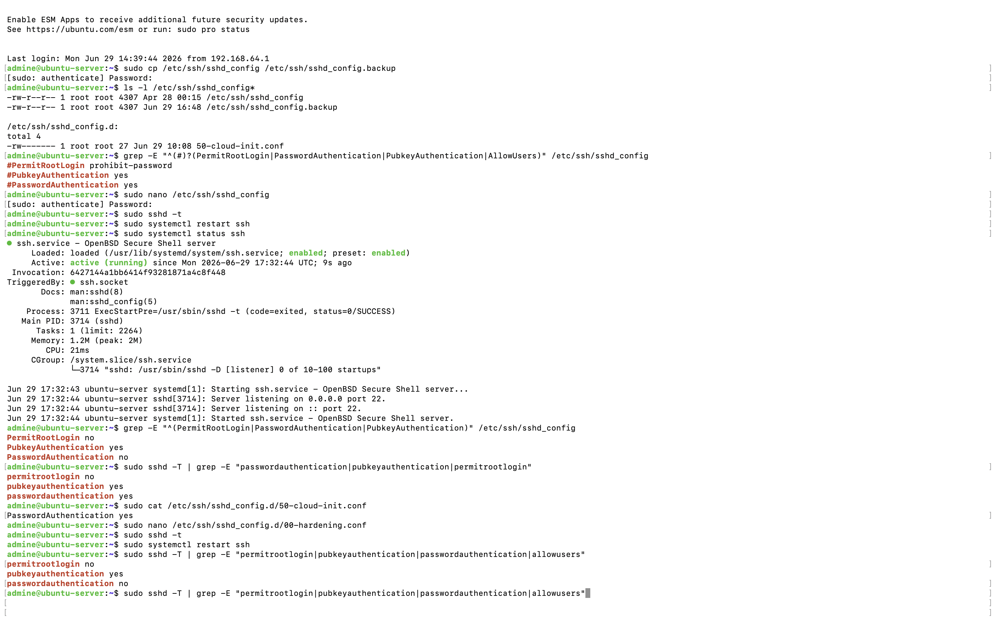

# Chapter 5: SSH Hardening

## Objective

The goal of this chapter was to improve the security of the OpenSSH server by disabling insecure authentication methods and restricting remote access. The server was configured to allow only SSH key authentication, preventing password based logins and reducing the risk of brute force attacks.

## Why SSH Hardening Matters

SSH is the primary method used to administer Linux servers remotely. By default many systems allow password authentication which exposes the server to automated password guessing and brute force attacks. Hardening SSH reduces the attack surface by disabling password authentication, preventing root login over SSH, restricting access to authorized users only and enforcing SSH key authentication

# Step 1: Backup the SSH Configuration

Before modifying any configuration file a backup was created to allow recovery if any mistakes were made.

```bash
sudo cp /etc/ssh/sshd_config /etc/ssh/sshd_config.backup
```

The backup was verified:

```bash
ls -l /etc/ssh/sshd_config*
```

# Step 2: Review Current Configuration

The active SSH options were inspected before making any changes.

```bash
grep -E "^(#)?(PermitRootLogin|PasswordAuthentication|PubkeyAuthentication)" /etc/ssh/sshd_config
```

Initially the configuration contains following commented options represented the default Ubuntu configuration.
```text
#PermitRootLogin prohibit-password
#PubkeyAuthentication yes
#PasswordAuthentication yes
```

# Step 3:  Harden the SSH Configuration

The SSH configuration file was edited using Nano.

```bash
sudo nano /etc/ssh/sshd_config
```

The following settings were configured:

```text
PermitRootLogin no
PubkeyAuthentication yes
PasswordAuthentication no
```

These changes provide the following security improvements:

| Setting | Purpose |
|----------|----------|
| PermitRootLogin no | Prevents direct root logins over SSH |
| PubkeyAuthentication yes | Enables secure public key authentication |
| PasswordAuthentication no | Disables password-based authentication |

# Step 4 : Validate the Configuration

Before restarting the SSH service, the configuration syntax was verified. No output indicates that the configuration contains no syntax errors.

```bash
sudo sshd -t
```
# Step 5: Restart the SSH Service

After validating the configuration the SSH service was restarted.

```bash
sudo systemctl restart ssh
```

The service status was then verified.

```bash
sudo systemctl status ssh
```

Expected result:

```text
Active: active (running)
```

# Step 6 : Troubleshooting

During testing, password authentication was unexpectedly still enabled.

The effective SSH configuration was inspected using:

```bash
sudo sshd -T | grep -E "permitrootlogin|pubkeyauthentication|passwordauthentication"
```

The output showed:

```text
passwordauthentication yes
```

Further investigation revealed that Ubuntu **cloud-Init** had created an additional SSH configuration file:

```text
/etc/ssh/sshd_config.d/50-cloud-init.conf
```

This file contained:

```text
PasswordAuthentication yes
```

To override this behavior i created a hardening configuration file.

```bash
sudo nano /etc/ssh/sshd_config.d/00-hardening.conf
```

The following settings were added:

```text
PermitRootLogin no
PubkeyAuthentication yes
PasswordAuthentication no
AllowUsers admine
```

The configuration was validated again.

```bash
sudo sshd -t
```

SSH was restarted.

```bash
sudo systemctl restart ssh
```

The effective configuration was verified:

```bash
sudo sshd -T | grep -E "permitrootlogin|pubkeyauthentication|passwordauthentication|allowusers"
```

Expected output:

```text
permitrootlogin no
pubkeyauthentication yes
passwordauthentication no
allowusers admine
```


# Step 7: Verify the Hardening

A new SSH session was opened from the client computer to confirm that key authentication still worked. After confirming successful login password authentication was intentionally forced using:

```bash
ssh \
-o PreferredAuthentications=password \
-o PubkeyAuthentication=no \
admine@192.168.64.5
```

The server responded:

```text
Permission denied (publickey).
```

This confirmed that password authentication was disabled, SSH keys were required and the server was successfully hardened

# Evidence

## SSH Hardening and Configuration



## Password Authentication Test


# Skills Demonstrated

- SSH security hardening
- OpenSSH configuration
- Configuration backup and recovery
- Service validation
- Linux service management
- SSH troubleshooting
- Cloud-Init configuration awareness
- Secure remote administration
- Configuration verification
- Authentication testing

---

# Lessons Learned

This chapter demonstrated that modifying a configuration file is only one part of system administration.

Equally important is verifying the effective configuration, identifying configuration overrides, troubleshooting unexpected behavior, and validating security changes through practical testing.

The use of `sshd -T` highlighted how Ubuntu's Cloud-Init configuration can influence SSH settings and reinforced the importance of verifying the active configuration rather than assuming configuration files are applied as expected.
