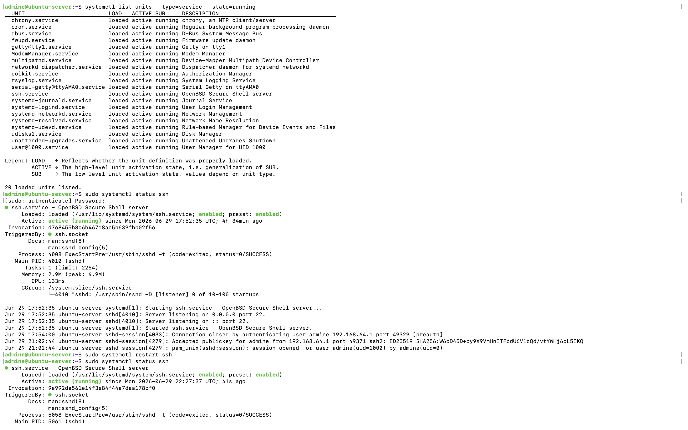
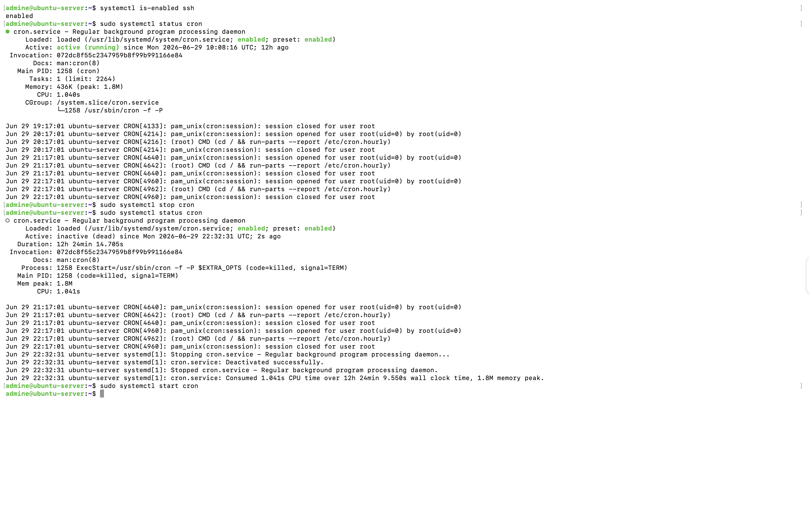
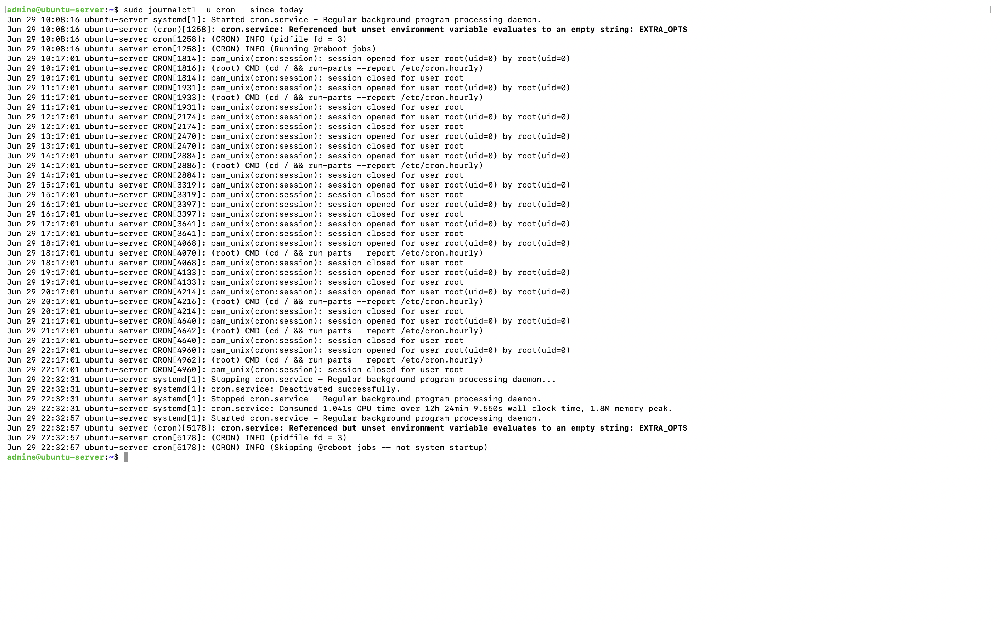
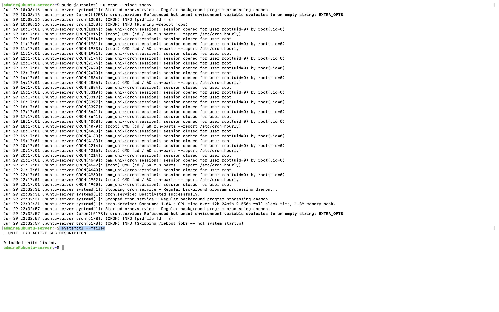

# Chapter 7: Systemd and Service Management

## Objective

This chapter demonstrates how to manage Linux services using `systemd`. The exercises include listing running services, checking service status, restarting services, enabling services at boot, reviewing service logs and identifying failed services.

# Why Systemd?

`systemd` is the default service manager in modern Ubuntu Linux distributions. Nearly every critical component of a Linux server is managed through `systemd`.
It is responsible for following,

- Starting services during boot
- Managing background processes (daemons)
- Monitoring service health
- Recording service logs
- Starting and stopping services on demand

## Listing Running Services

The following command displays all currently running services. This provides administrators with a quick overview of active services.

```bash
systemctl list-units --type=service --state=running
```

## Viewing Service Status

To inspect a specific service:

```bash
sudo systemctl status ssh
```

The status output includes:

- Service name
- Current state
- Whether it is enabled during boot
- Process ID
- Memory usage
- Recent log entries

After modifying SSH configuration in the previous chapter the service was restarted successfully and verified to be active.


## Restarting a Service

Services can be restarted without rebooting the server.

Example:

```bash
sudo systemctl restart ssh
```

## Checking if a Service Starts Automatically

The following command checks whether a service is enabled during system boot.

```bash
systemctl is-enabled ssh
```

Output:

```
enabled
```

It confirms that the SSH service will automatically start whenever the server boots.


## Managing Services

The Cron service was used to demonstrate starting and stopping services.

View service status:

```bash
sudo systemctl status cron
```

Stop the service:

```bash
sudo systemctl stop cron
```

Start the service again:

```bash
sudo systemctl start cron
```
The service status confirmed that the daemon stopped successfully and was started again without errors.
## Viewing Service Logs

System logs can be viewed using `journalctl`. It allows administrators to troubleshoot services without manually inspecting multiple log files.

Example:

```bash
sudo journalctl -u cron --since today
```

This command displays following output

- service startup events
- scheduled cron executions
- service stop events
- service restart events

## Checking Failed Services

The following command lists failed services.

```bash
systemctl --failed
```

Output:

```
0 loaded units listed.
```

This indicates that no system services were currently in a failed state.


# Commands Used

```bash
systemctl list-units --type=service --state=running

sudo systemctl status ssh

sudo systemctl restart ssh

systemctl is-enabled ssh

sudo systemctl status cron

sudo systemctl stop cron

sudo systemctl start cron

sudo journalctl -u cron --since today

systemctl --failed
```

# Evidence

### Running services and SSH service management




### Managing the Cron service




### Viewing Cron logs using Journalctl




### Verifying failed services




# Learning Outcomes

After completing this chapter I was able to:

- Understand the purpose of systemd
- List running services
- Inspect service status
- Restart services safely
- Verify boot time service configuration
- Start and stop services
- Review service logs using journalctl
- Check the system for failed services

These activities demonstrate fundamental Linux service administration skills commonly required when managing Ubuntu servers.
