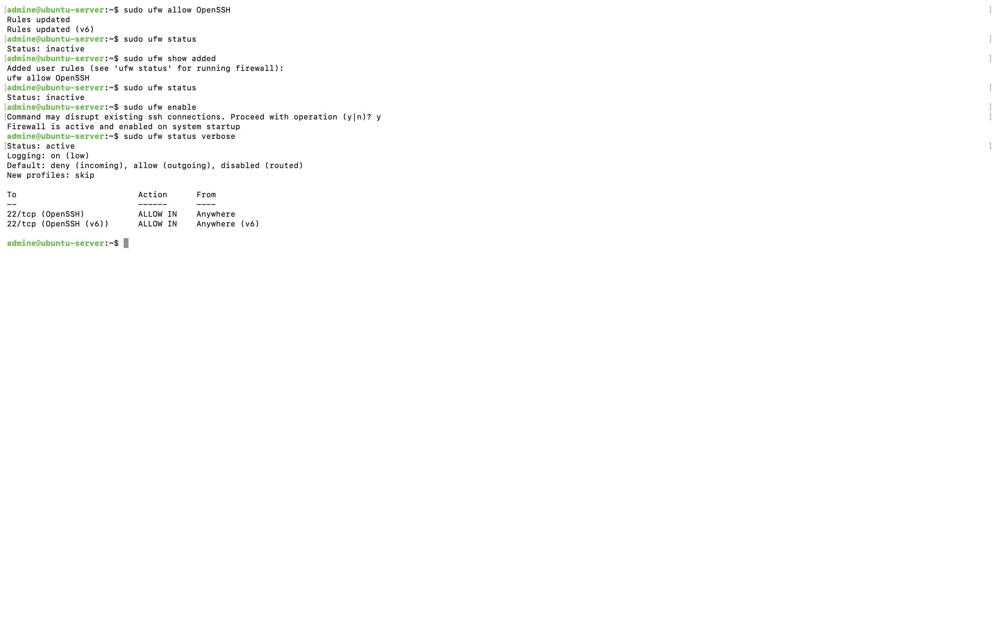
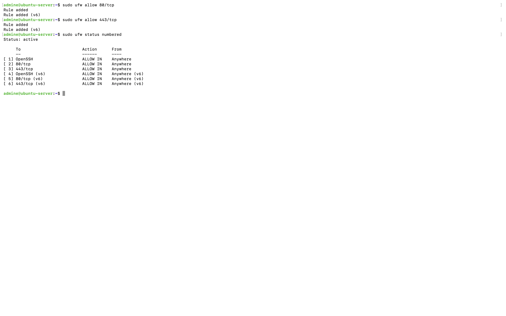
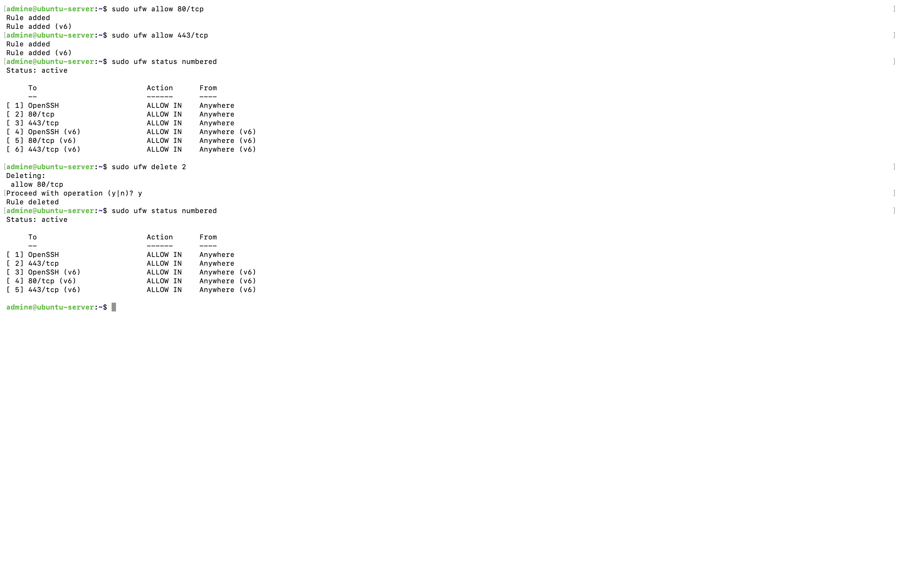
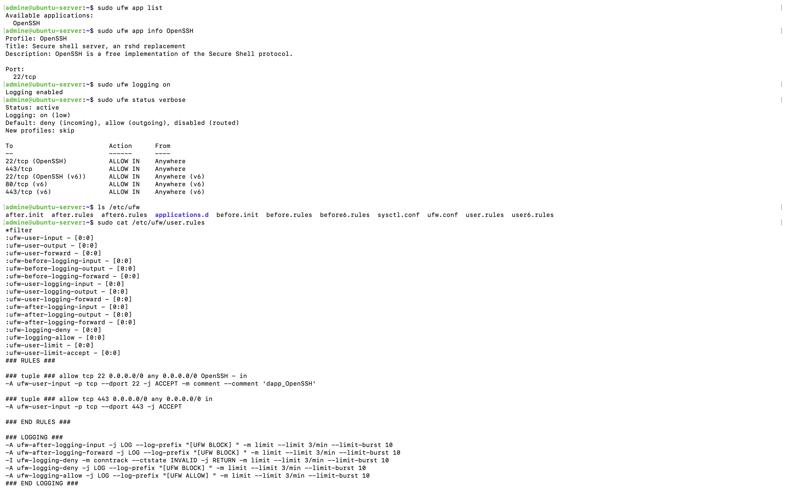

# Chapter 9: Firewall Configuration with UFW

## Introduction

A firewall is one of the most important security mechanisms on any server. It monitors incoming and outgoing network traffic and enforces rules that determine which connections are permitted or blocked. Ubuntu Server includes **UFW (Uncomplicated Firewall)**, a user friendly interface for managing Linux firewall rules built on top of **iptables/nftables**. UFW simplifies firewall administration while still providing powerful protection against unauthorized network access.

In this lab I configured UFW on my Ubuntu Server, enabled firewall protection, created rules to allow essential services, removed unnecessary rules, explored application profiles, enabled firewall logging and examined how UFW stores its configuration.

# Learning Objectives

By completing this chapter I learned how to:

- Understand the purpose of a host based firewall.
- Enable and disable UFW safely.
- Configure firewall rules for SSH.
- Allow HTTP and HTTPS traffic.
- View firewall status and numbered rules.
- Delete firewall rules.
- Use UFW application profiles.
- Enable firewall logging.
- Locate UFW configuration files.

# Why Firewalls Matter

Without a firewall, every listening service on a server is potentially reachable from the network.

A properly configured firewall reduces the attack surface by:

- Blocking unwanted connections.
- Allowing only required services.
- Restricting access to management ports.
- Logging network activity.
- Supporting defense in depth security.

## Step 1: Verifying UFW Installation

Ubuntu Server ships with UFW installed by default. Initially the firewall was inactive. To verify its status following command was used.

```bash
sudo ufw status
```

## Step 2: Allowing SSH Before Enabling the Firewall

Since I manage my Ubuntu Server remotely using SSH so i first allowed SSH traffic before enabling the firewall.

```bash
sudo ufw allow OpenSSH
```

Using the application profile automatically opens the correct port (TCP 22).

Checking the configured rules:

```bash
sudo ufw show added
```

### Evidence



## Step 3: Enabling the Firewall

After confirming the SSH rule existed, I enabled UFW.

```bash
sudo ufw enable
```

UFW displayed the warning:

```
Command may disrupt existing ssh connections.
Proceed with operation (y|n)?
```

Because the OpenSSH rule had already been added, it was safe to continue. I used following command to verify the firewall configuration,

```bash
sudo ufw status verbose
```
Output showed:

- Firewall active
- Default incoming policy: deny
- Default outgoing policy: allow
- OpenSSH permitted

These defaults provide a secure baseline while allowing outbound connections.


## Step 4: Allowing Web Traffic

Many Linux servers host web applications.

To allow HTTP traffic:

```bash
sudo ufw allow 80/tcp
```

To allow HTTPS traffic:

```bash
sudo ufw allow 443/tcp
```

Viewing all configured rules:

```bash
sudo ufw status numbered
```

### Evidence



## Step 5: Removing Firewall Rules

Firewall rules should be reviewed periodically. If a service is no longer required, its firewall rule should be removed. Using numbered rules simplifies deletion.

Example:

```bash
sudo ufw delete 2
```
The selected rule was removed then viewing the updated firewall rules:

```bash
sudo ufw status numbered
```


### Evidence



## Step 6: Understanding UFW Application Profiles

An application profile in UFW is a predefined firewall rule for a common application or service. Instead of remembering which ports a service uses UFW already knows them. Instead of opening ports manually UFW provides application profiles. It simplify administration because administrators only need to remember service names instead of individual port numbers. To view available profiles:

```bash
sudo ufw app list
```
Viewing information about the OpenSSH profile:

```bash
sudo ufw app info OpenSSH
```

Output:

```
Profile: OpenSSH
Port:
22/tcp
```

## Step 7: Enabling Firewall Logging

UFW supports several logging levels.

To enable logging:

```bash
sudo ufw logging on
```

Checking the firewall:

```bash
sudo ufw status verbose
```

Output:

```
Logging: on (low)
```

Firewall logs can later be reviewed when investigating suspicious activity or troubleshooting network connectivity.


## Step 8: UFW Configuration Files

UFW stores its configuration in:

```bash
/etc/ufw/
```

Listing the configuration directory:

```bash
ls /etc/ufw
```
Important files include:

| File | Purpose |
|-------|----------|
| before.rules | Rules loaded before user rules |
| after.rules | Rules loaded after user rules |
| user.rules | IPv4 firewall rules |
| user6.rules | IPv6 firewall rules |
| applications.d | Application profiles |
| ufw.conf | UFW configuration |

To inspect the active firewall rules stored on disk:

```bash
sudo cat /etc/ufw/user.rules
```
This file contains the iptables rules generated by UFW based on the firewall configuration.


## Evidence



# What I Learned

Through this chapter I gained practical experience configuring and managing Ubuntu Uncomplicated Firewall (UFW). I learned how to safely enable the firewall without disrupting SSH access by creating the required rule beforehand. I also configured rules for common web services, removed unnecessary firewall rules, explored application profiles, enabled firewall logging, and examined how UFW stores its configuration. This lab reinforced the importance of host based firewalls as a fundamental layer of Linux server security and demonstrated how UFW provides a simple yet effective way to control network access.

# Key Commands Used

```bash
sudo ufw status
sudo ufw status verbose
sudo ufw enable
sudo ufw disable

sudo ufw allow OpenSSH
sudo ufw allow 80/tcp
sudo ufw allow 443/tcp

sudo ufw status numbered
sudo ufw delete <rule-number>

sudo ufw show added

sudo ufw app list
sudo ufw app info OpenSSH

sudo ufw logging on

ls /etc/ufw
sudo cat /etc/ufw/user.rules
```

